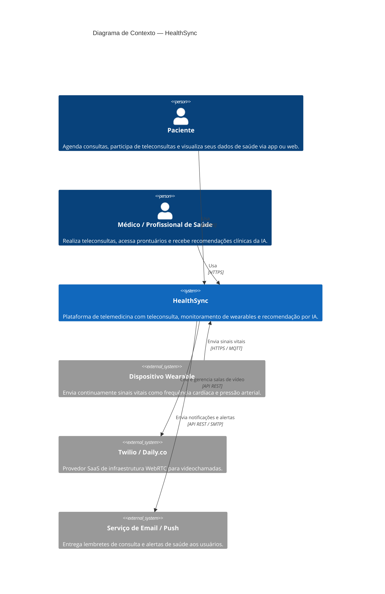
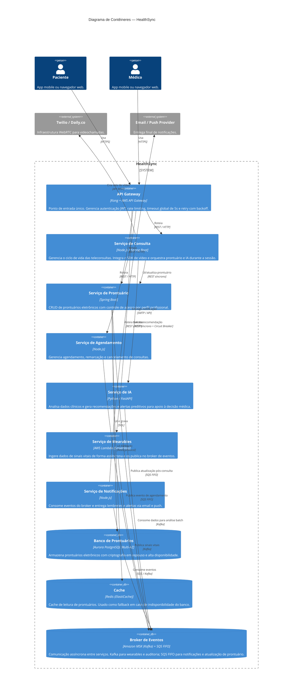
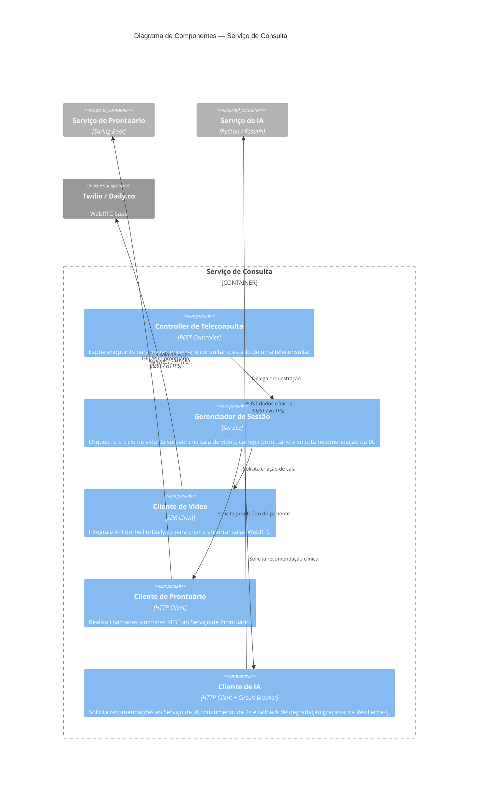
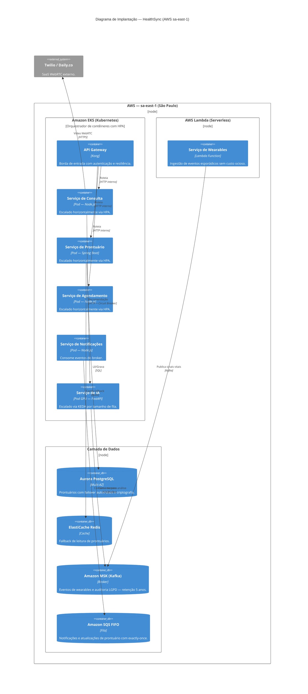

# SAD — Software Architecture Document
## HealthSync — Plataforma de Telemedicina Inteligente

> **Versão:** 1.0 · **Ciclo:** 4 · **Status:** Aprovado

---

## 1. Visão Executiva

### O que é o HealthSync

O HealthSync é uma plataforma de telemedicina inteligente que conecta pacientes e profissionais de saúde de forma segura e acessível. A solução integra três pilares funcionais: **teleconsultas por videochamada**, **monitoramento remoto de sinais vitais via wearables** e **recomendações clínicas geradas por Inteligência Artificial**.

### Qual problema resolve

O acesso à saúde de qualidade ainda é limitado por barreiras geográficas, filas de espera e falta de continuidade no acompanhamento do paciente. O HealthSync endereça esses problemas ao:

- Eliminar a necessidade de deslocamento para consultas de acompanhamento e triagem;
- Permitir que médicos monitorem sinais vitais de pacientes crônicos em tempo real, mesmo à distância;
- Apoiar a tomada de decisão clínica com análise preditiva, reduzindo erros por sobrecarga de informação.

### Estado atual — Fase 4

Na Fase 4 (Ciclo 3), a arquitetura está consolidada com todas as decisões estruturais registradas em ADRs aceitos. Os microserviços principais estão definidos e mapeados, a estratégia de nuvem e escalabilidade foi estabelecida (ADR 0001), os padrões de resiliência estão especificados (ADR 0002) e o modelo de comunicação híbrido foi formalizado (ADR 0003). O projeto encontra-se na transição entre a fase de design arquitetural e o início da implementação incremental dos serviços de maior valor de negócio — Consulta, Prontuário e Agendamento.

---

## 2. Visões Arquiteturais

### 2.1 Visão de Contexto — C4 Nível 1

Apresenta o sistema como uma caixa preta e identifica todos os atores e sistemas externos que interagem com ele.

---

### 2.2 Visão de Contêineres — C4 Nível 2

Detalha os contêineres que compõem o HealthSync — aplicações, serviços e armazenamentos de dados.

---

### 2.3 Visão de Componentes — C4 Nível 3

Detalha os componentes internos do **Serviço de Consulta**, núcleo funcional da plataforma.

---

### 2.4 Visão de Implantação

Descreve a distribuição dos contêineres na infraestrutura AWS `sa-east-1` (São Paulo), garantindo conformidade com a LGPD.

---

## 3. Decisões Arquiteturais (ADRs)

| ADR | Título | Decisão Central | Status |
|-----|--------|-----------------|--------|
| ADR 0000 | Arquitetura de Microserviços | Cada funcionalidade principal opera como serviço independente via REST e mensageria assíncrona | Aceito |
| ADR 0001 | Estratégia de Nuvem e Escalabilidade | PaaS (EKS) + Serverless (Lambda) com escalabilidade horizontal via HPA/KEDA na AWS `sa-east-1` | Aceito |
| ADR 0002 | Padrões de Resiliência | API Gateway centralizado + Circuit Breaker (Resilience4j) + Bulkhead por thread pool | Aceito |
| ADR 0003 | Modelo de Comunicação | REST síncrono para fluxos imediatos; Kafka + SQS assíncrono para fluxos tolerantes a atraso | Aceito |

---

## 4. Atributos de Qualidade

| Atributo | Requisito (RNF) | Estratégia Arquitetural |
|---|---|---|
| **Disponibilidade** | ≥ 99,5 % | Multi-AZ, HPA, Circuit Breaker, liveness/readiness probes |
| **Desempenho** | < 3 s de resposta | REST síncrono nos fluxos de usuário, cache Redis, escalabilidade horizontal |
| **Segurança / LGPD** | Criptografia ponta a ponta | JWT no gateway, criptografia em repouso no Aurora, dados restritos à região `sa-east-1` |
| **Escalabilidade** | Horizontal automática | Kubernetes HPA para serviços de negócio, Lambda para wearables, KEDA para IA |
| **Integridade** | Dados clínicos não alterados | SQS FIFO com exactly-once, Kafka com retenção imutável para auditoria |
